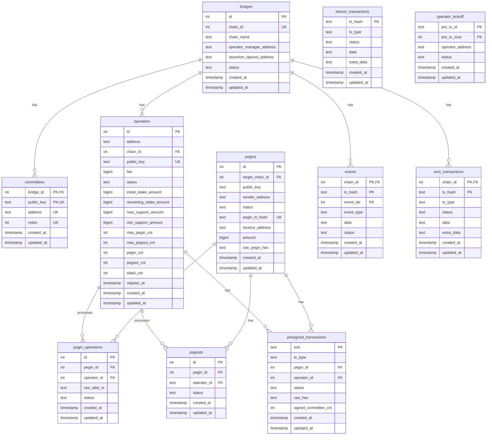

```mermaid
erDiagram
    bridges {
        int id PK
        int chain_id UK
        text chain_name
        text operator_manager_address
        text assertion_taproot_address
        text status
        timestamp created_at
        timestamp updated_at
    }

    committees {
        int bridge_id PK, FK
        text public_key PK, UK
        text address UK
        int index UK
        timestamp created_at
        timestamp updated_at
    }

    operators {
        int id PK
        text address
        int chain_id FK
        text public_key UK
        bigint fee
        text status
        bigint initial_stake_amount
        bigint remaining_stake_amount
        bigint max_support_amount
        bigint min_support_amount
        int max_pegin_cnt
        int max_pegout_cnt
        int pegin_cnt
        int pegout_cnt
        int slash_cnt
        timestamp register_at
        timestamp created_at
        timestamp updated_at
    }

    pegins {
        int id PK
        int target_chain_id FK
        text public_key
        text sender_address
        text status
        text pegin_tx_hash UK
        text receive_address
        bigint amount
        text raw_pegin_hex
        timestamp created_at
        timestamp updated_at
    }

    pegin_operations {
        int id PK
        int pegin_id FK
        int operator_id FK
        text raw_take_tx
        text status
        timestamp created_at
        timestamp updated_at
    }

    pegouts {
        int id PK
        int pegin_id FK
        text operator_id FK
        text status
        timestamp created_at
        timestamp updated_at
    }

    presigned_transactions {
        text txid PK
        text tx_type
        int pegin_id FK
        int operator_id FK
        text status
        text raw_hex
        int signed_committee_cnt
        timestamp created_at
        timestamp updated_at
    }

    events {
        int chain_id PK, FK
        text tx_hash PK
        int event_idx PK
        text event_type
        text data
        text status
        timestamp created_at
        timestamp updated_at
    }

    evm_transactions {
        int chain_id PK, FK
        text tx_hash PK
        text tx_type
        text status
        text data
        text extra_data
        timestamp created_at
        timestamp updated_at
    }

    bitcoin_transactions {
        text tx_hash PK
        text tx_type
        text status
        text data
        text extra_data
        timestamp created_at
        timestamp updated_at
    }

    operator_kickoff {
        text pre_tx_id PK
        int pre_tx_vout PK
        text operator_address
        text status
        timestamp created_at
        timestamp updated_at
    }

    bridges ||--o{ committees : "has"
    bridges ||--o{ operators : "has"
    bridges ||--o{ events : "has"
    bridges ||--o{ evm_transactions : "has"

    operators ||--o{ pegin_operations : "processes"
    operators ||--o{ pegouts : "processes"
    operators ||--o{ presigned_transactions : "has"

    pegins ||--o{ pegin_operations : "has"
    pegins ||--o{ pegouts : "has"
    pegins ||--o{ presigned_transactions : "has"

```